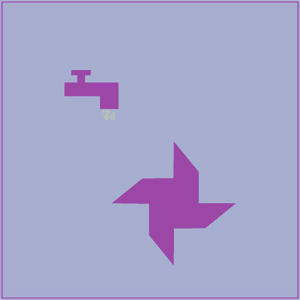

# SDF-based collision detection with MPM2D
I integrate an SDF-based collision detection into an MPM simulator.

The SDF algorithm is inspired by [Yuanming Hu's Taichi](https://github.com/yuanming-hu/taichi).
And the MPM algorithm is from [Elias-Gu's MPM2D](https://github.com/Elias-Gu/MPM2D).

# Result

