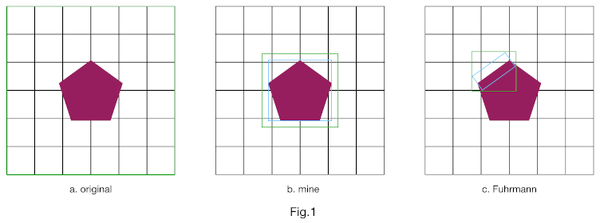
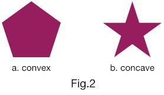

# SDF-based collision detection with MPM2D
I integrate an SDF-based collision detection into an MPM simulator.

The SDF algorithm is inspired by [Yuanming Hu's Taichi](https://github.com/yuanming-hu/taichi).

The MPM algorithm is from [Elias-Gu's MPM2D](https://github.com/Elias-Gu/MPM2D).

# About the computation of SDF

The original method (Fig.1a) that I use to compute SDF is too expensive,
because it iterates all the grid points.
For example, in the demo, it takes more than `60s` to render a frame.

However, only grid points inside the narrow-band of the polygon are necessary.
So to reduce the unnecessary computation,
I first select an area (the green box in Fig.1b) that is a little bigger than the AABB (the blue box in Fig.1b) of the polygon.
Then, I iterate grid points inside this area.
Now it only takes `8~9s` to render a frame in the demo.

In fact, my method is inspired by [\[Fuhrmann,2003\]](https://pdfs.semanticscholar.org/ec41/48aed023dfe1ba6f42a198613800fe29ae37.pdf) (Fig.1c).
Although their method is for 3D case, it can be applied in 2D.
For each edge, first, displace it a little along with its normal direction and the opposite direction to make a small box (the blue box in Fig.1c).
Then, compute the AABB (the breen box in Fig.1c) of this box.
Finally, iterate grid points inside this AABB. (I didn't implement this method yet)

## Which one to use?

From my point of view,
if the polygon is convex (Fig.2a),
then Fuhrmann's method is the best.
Otherwise, if the polygon is concave (Fig.2b), my method is the best.

For a convex polygon, a large part of grid points occupied by its inner area are redundant.
Fuhrmann's method avoids them to some extent.
In contrast, my method iterates all those grid points.
However, for a concave polygon (Fig.2b),
the number of overlapped grid points caused by Fuhrmann's method is remarkable.
On the orther hand, my method does not produce overlapped grid points.

In addition, my method only requires vertex positions.
But Fuhrmann's method also requires edges and their normals.

# Result

# Reference
\[Fuhrmann,2003\] Fuhrmann, Arnulph, Gerrit Sobotka, and Clemens Groß. "Distance fields for rapid collision detection in physically based modeling." Proceedings of GraphiCon 2003. 2003.
